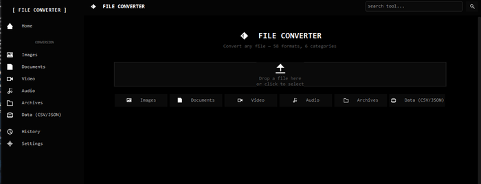
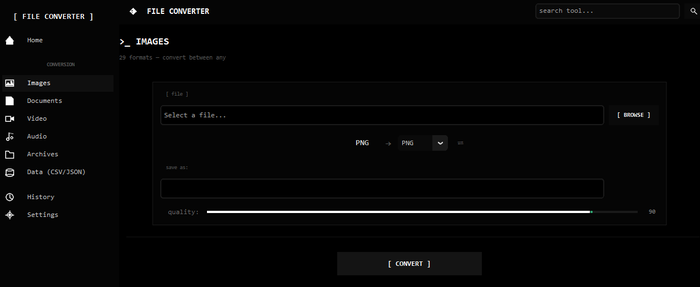

# FILE CONVERTOR

> Drop a file. Pick a format. Done.

A simple file converter for Windows. Works offline. No ads. No signup.

---

## 📸 Screenshots

---

## 📦 What you can convert

| Category | Formats | Count |
|----------|---------|-------|
| 🖼️ Images | PNG ↔ JPEG ↔ WEBP ↔ BMP ↔ GIF ↔ TIFF ↔ ICO ↔ AVIF ↔ PPM ↔ PCX ↔ TGA ↔ QOI ↔ DDS ↔ SGI ↔ PDF ↔ more | **29** |
| 🎬 Video | MP4 ↔ AVI ↔ MOV ↔ MKV ↔ WEBM ↔ GIF ↔ FLV ↔ WMV ↔ M4V ↔ MPEG ↔ 3GP ↔ OGV ↔ TS ↔ VOB ↔ more | **17** |
| 🎵 Audio | MP3 ↔ WAV ↔ OGG ↔ FLAC ↔ M4A ↔ AAC ↔ OPUS ↔ AIFF ↔ AC3 ↔ WMA ↔ more | **12** |
| 📄 Documents | TXT ↔ PDF ↔ DOCX | **3** |
| 🗜️ Archives | ZIP / TAR / TAR.GZ | **3** |
| 📊 Data | CSV ⟷ JSON | **2** |

**58 formats. 6 categories. One app.**

---

## ✨ Features

- Dark minimal UI — dark theme, Consolas font, sharp edges
- Drag & drop — drop a file on the home page, app detects the type
- Swap formats — one click to swap source and target (⇄)
- Custom filename — edit output name before converting
- Quality & bitrate — fine-tune images, audio, video
- Cancel — stop conversion anytime
- Open file — [OPEN] button appears after conversion
- History — all conversions saved
- English / Русский — switch in settings
- 100% offline — your files stay on your computer

---

## ⬇️ Download

| Version | What to do |
|---------|-----------|
| **Portable** | Download `FileConvertor.exe` and run it. No install. |
| **Installer** | Download `FileConvertor_Setup_v1.0.0.exe`, run, click Next. |
| **From source** | `git clone` → `pip install -r requirements.txt` → `python src/main.py` |

[Latest release →](https://github.com/xacrisoftware/FileConvertor/releases)

---

## 🔧 Requirements

- Windows 10 or 11 (64-bit)
- [FFmpeg](https://ffmpeg.org/) — needed for video & audio (`winget install ffmpeg` or download from ffmpeg.org)

---

## 🧱 Built with

[Python](https://python.org) + [CustomTkinter](https://customtkinter.tomschimansky.com)  
[Pillow](https://python-pillow.org) · [moviepy](https://zulko.github.io/moviepy) · [pydub](https://github.com/jiaaro/pydub)  
[fpdf2](https://pyfpdf.github.io/fpdf2) · [python-docx](https://python-docx.readthedocs.io) · [PyMuPDF](https://pymupdf.readthedocs.io)

---

## 📄 License

MIT — do whatever you want.
